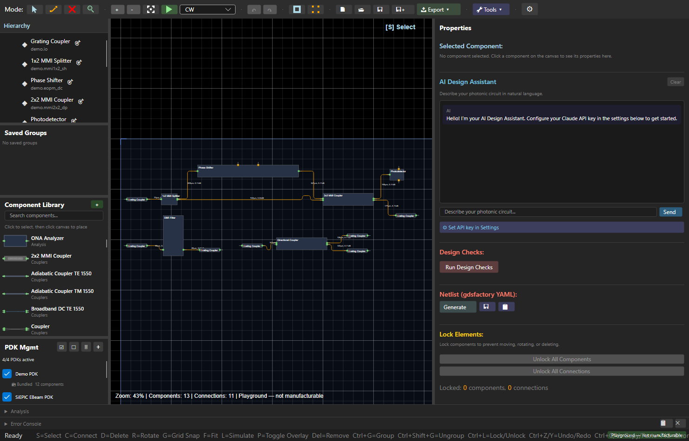
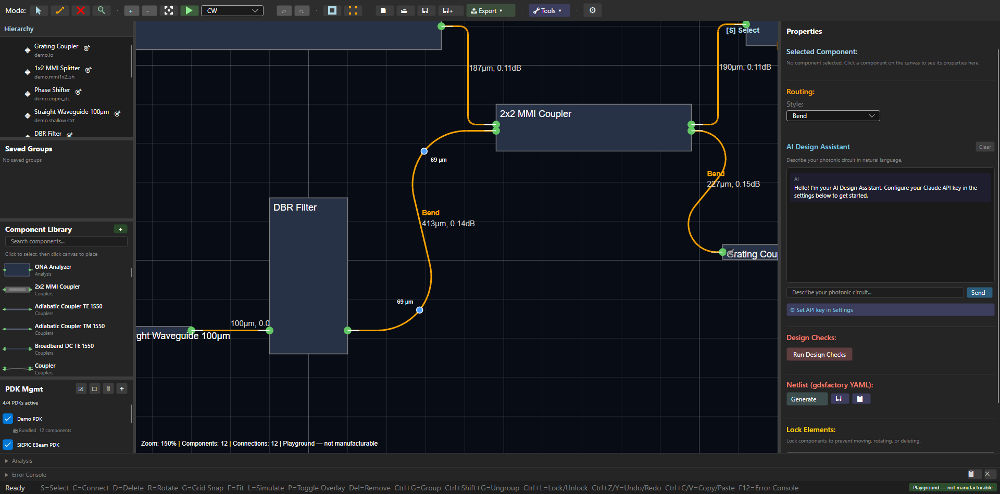
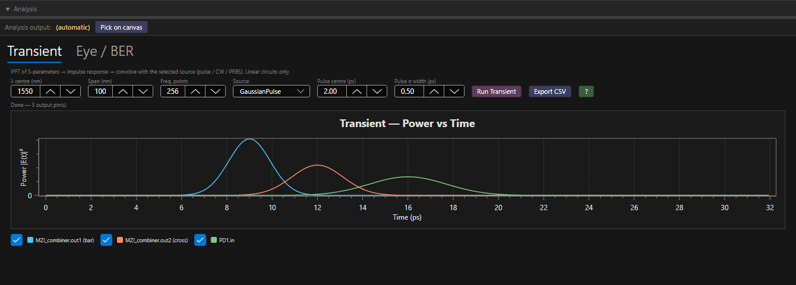
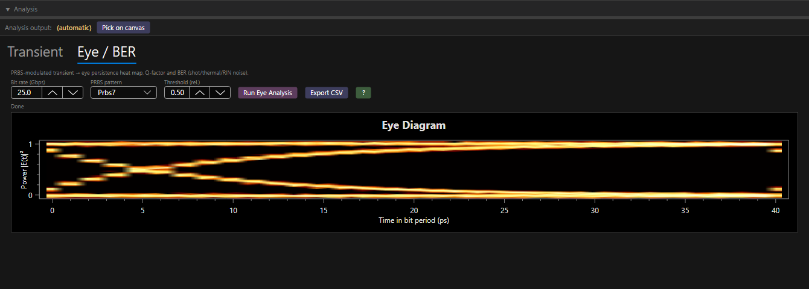
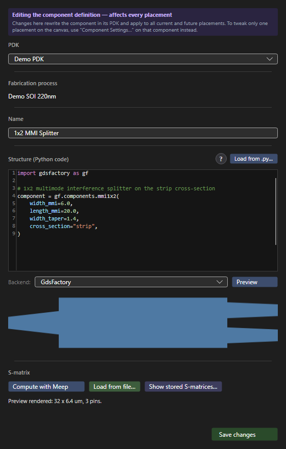
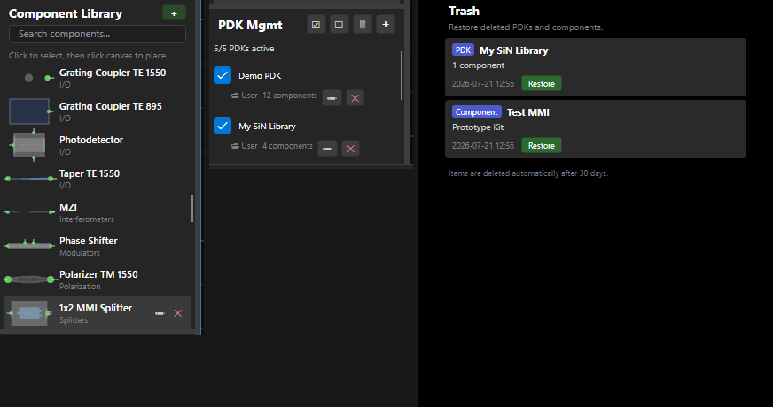
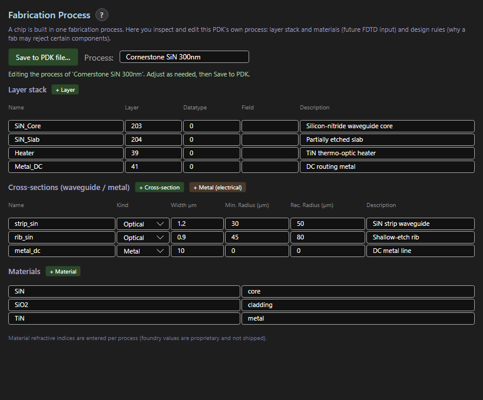
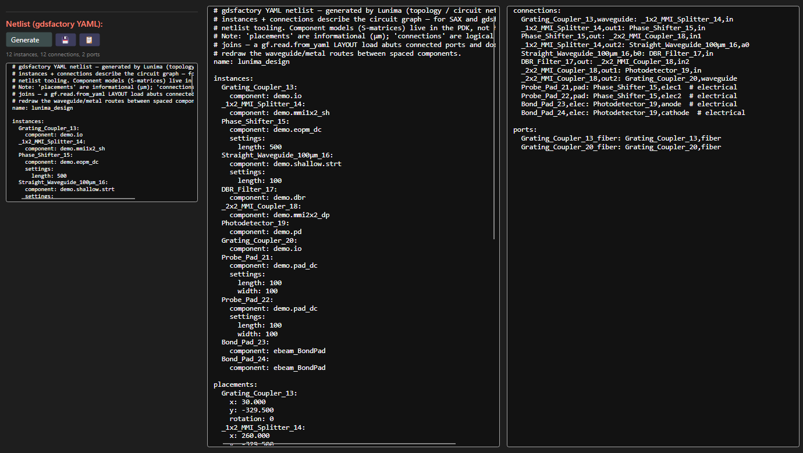
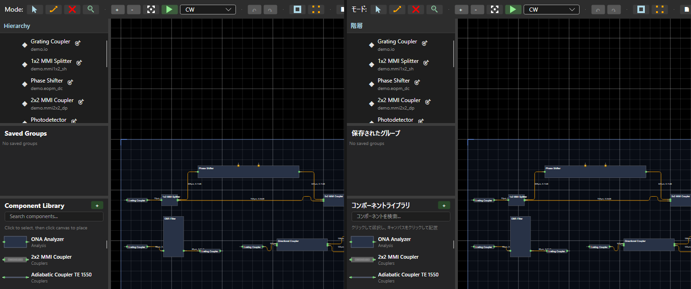

# Lunima

**Design, simulate, and lay out photonic integrated circuits — visually, on your own PDK, with open formats at every step.**



*A live CW simulation on a staged Mach-Zehnder chip: simulated power flow rendered directly on the waveguides (color + dB/percent labels), DC probe and bond pads wired with metal traces, diagonal routing, and hand-styled bends — built from the bundled Demo and SiEPIC PDKs.*

[**Download v0.12.0**](https://github.com/aignermax/Lunima/releases/tag/v0.12.0) · [Landing page](https://aignermax.github.io/Lunima/) · [Changelog](CHANGELOG.md) · [Architecture](ARCHITECTURE.md)

---

## Layout & routing

Lunima's canvas is built for direct manipulation: click a routed connection and it becomes editable geometry, not a black-box autoroute.



- **Figma-style waveguide editing** — select a connection to get draggable in-canvas bend-radius handles with live radius labels; every segment shows its exact length and loss (e.g. `413 µm, 0.14 dB`).
- **Per-connection routing styles** — choose SBend, Bend, and custom radii per connection instead of accepting one global autoroute; freeze routes you've tuned by hand. Manual edits are never silently overwritten.
- **Process-aware routing** — the A\* router honors your fabrication process's minimum bend radius; radius handles clamp to the process floor.
- **Diagonal routing (opt-in beta)** — 45° routes for denser layouts. Works, but is still slow on large designs; enable it in Settings → Routing.
- **Automatic crossing insertion (opt-in)** — inserts a real PDK crossing component where waveguides must cross. Off by default.
- **Metal routing** — wire DC probe pads and bond pads to modulator and detector contacts with electrical traces, alongside the optical layer.
- Snapping, grouping, hierarchy with reusable subcircuits, element locking, and undo/redo throughout.

## Simulate & measure

Simulation is not a separate app — it runs on the canvas while you design, and every result can leave the tool as data.





- **Live CW power flow** — run a continuous-wave simulation and read power directly off the canvas: waveguide color plus dB/percent labels on every connection.
- **Transient analysis** — IFFT of the circuit S-parameters convolved with your source (Gaussian pulse, CW, PRBS), plotted per output pin; a sample-mode driver with a signal-source library drives active, time-dependent compact models such as modulators.
- **Eye / BER analysis** — fold a PRBS-modulated transient into an eye-persistence heat map, with Q-factor and BER estimates (shot/thermal/RIN noise), bit-rate and decision-threshold controls, and CSV export.
- **ONA sweeps** — place an Optical Network Analyzer component to sweep transmission over wavelength.
- **FDTD with Meep** — recompute a component's S-matrix from its actual geometry using the open-source Meep FDTD solver in Docker; a guided setup dialog walks you through installing Docker if it's missing.
- **Bring measured data back** — load S-matrices from file (measured on your own devices or computed in another tool) onto any component, and inspect stored S-matrices per component.
- **Mode-slice inspector** — point-and-probe waveguide modes anywhere on the canvas, including fiber overlap at couplers.

## Your PDK, your components

Custom PDKs are a first-class flow, not an expert backdoor. Lunima ships with a Demo PDK, a CornerStone SiN library, and a SiEPIC EBeam PDK, and everything they can do, your own libraries can do too.



- **Define components in Python** — write or paste a component definition in **gdsfactory or nazca** (both backends are supported end to end, from geometry preview to GDS export), preview the rendered geometry, and compute its S-matrix with Meep — all in one editor.
- **Fork-on-save** — editing a bundled component forks it into your own user PDK, which shadows the original; a per-component quick action restores the original at any time.
- **Trash, not dread** — deleted PDKs and single components go to a trash panel and can be restored for 30 days.



- **Fabrication-process editor** — each PDK carries its process: GDS layer stack, optical and metal cross-sections with minimum and recommended bend radii (which the router enforces), and materials with your own refractive indices. Foundry values stay yours — they are entered per process, not shipped.
- **Design checks** — validate a design against its process, including layer-divergence warnings when PDKs disagree.



## From canvas to fab

Designs are laid out against real foundry processes, not abstract schematics — so what leaves the tool is a GDS a fab can actually make.


- **Real foundry PDKs, bundled** — a [CornerStone](https://www.cornerstone.sotonfab.co.uk/) SiN 300 nm library and the open [SiEPIC EBeam](https://github.com/SiEPIC/SiEPIC_EBeam_PDK) SOI 220 nm PDK ship with the app, next to the Demo PDK. Bundled SiEPIC cells are pin-calibrated against their actual GDS geometry: the calibration editor renders the real polygons, reports per-pin deltas, and a Check-All pass verifies the whole library — with the shipped calibrations locked by end-to-end tests.
- **One design, one process** — every design is locked to a single fabrication process; components from incompatible PDKs can't land on the same chip. Free mixing lives in an explicit Playground mode that the status bar (and the exporter) honestly labels *not manufacturable*. Design checks enforce the rest: bend-radius floors in the router and the drag handles, layer-divergence warnings, calibrated pin positions.
- **GDS through gdsfactory *or* nazca** — one Export menu, two GDS back-ends: a runnable gdsfactory Python script (standalone geometry stubs or real ubcpdk/SiEPIC cells) or a nazca script, each generating the GDS layout alongside the code. Your own components can be defined in either backend, so the export path matches however you write geometry.
- **Honest scope** — Lunima gets you to a fab-ready GDS against your process design kit. Booking the MPW run and clearing the foundry's own sign-off DRC remains between you and your foundry — as it should be.

## Open by design

Every pipeline stage has an escape hatch. Nothing you build in Lunima is locked in.



- **gdsfactory YAML netlist export** — derive a circuit netlist straight from the canvas: instances with settings, informational placements, logical port-to-port connections (metal traces marked `# electrical`), and exposed ports. Copy it or save as `.yml` and feed it to SAX or any gdsfactory-based flow.
- **Open, diff-able PDKs** — component libraries are plain JSON ([format documentation](docs/PDK_JSON_FORMAT.md)); processes and S-matrices live in inspectable files, not a proprietary database.
- **GDS export** — export designs through gdsfactory or nazca to GDS for fabrication pipelines (see [From canvas to fab](#from-canvas-to-fab)).
- **Autorouting is optional** — routing can be styled, frozen, or replaced per connection; the router suggests, you decide.
- **AI design assistant** — describe a circuit in natural language (bring your own Claude API key).

## Speaks your language



The UI ships in five languages — **English, Deutsch, Español, 简体中文, 日本語** — auto-detected from your system and live-switchable: every toolbar, panel, and canvas HUD string re-reads instantly.

---

## Download

Get **[Lunima v0.12.0](https://github.com/aignermax/Lunima/releases/tag/v0.12.0)** — or browse [all releases](https://github.com/aignermax/Lunima/releases).

| Platform | Package | Notes |
|----------|---------|-------|
| **Windows** (x64) | [`Lunima-Setup-0.12.0.msi`](https://github.com/aignermax/Lunima/releases/download/v0.12.0/Lunima-Setup-0.12.0.msi) · [portable `.zip`](https://github.com/aignermax/Lunima/releases/download/v0.12.0/Lunima-0.12.0-win-x64.zip) | Installer or unzip-and-run |
| **Linux** (x64) | [`Lunima-0.12.0-linux-x64.tar.gz`](https://github.com/aignermax/Lunima/releases/download/v0.12.0/Lunima-0.12.0-linux-x64.tar.gz) | Extract into its own folder and run |
| **macOS** (Apple Silicon / Intel) | [`osx-arm64.dmg`](https://github.com/aignermax/Lunima/releases/download/v0.12.0/Lunima-0.12.0-osx-arm64.dmg) · [`osx-x64.dmg`](https://github.com/aignermax/Lunima/releases/download/v0.12.0/Lunima-0.12.0-osx-x64.dmg) | Unsigned — see note below |

macOS release builds ship as an **unsigned** `.dmg`; on first launch, remove the quarantine flag with `xattr -dr com.apple.quarantine /Applications/Lunima.app`.

Once installed, Lunima **updates itself in place** (download, swap, relaunch) on all three platforms; if the install location isn't writable, it points you to the releases page instead.

### Building from source

**Prerequisites:** .NET 10.0 SDK

```bash
# Quick start
make run      # or ./run.sh

# Build and test
dotnet build
dotnet test
```

---

## Vision: Photonic Intermediate Representation (PIR)

### The Central Idea

👉 **Lunima is becoming the central representation layer for photonic systems**

- **Today:** GUI-based design tool
- **Tomorrow:** Central PIR with multiple views and exports
- **Future:** Integration hub for PhotonTorch, PICWave, Verilog-A, LTSpice

### PIR = `.lun` File Format

The `.lun` file format is evolving to become the PIR — a tool-independent representation that:

- Defines components and connections as a **netlist / graph**
- Accumulates physical, structural, and simulation data over time
- Enables **export to and import from** different simulation tools
- Evolves from schematic → device simulation → circuit simulation → system co-simulation

**This means:**
- GUI is just one view of the PIR
- Export is just a transformation of the PIR
- AI becomes extremely powerful with structured access to PIR

### Role in the Photonics Toolchain

| Layer | Tools | Purpose |
|-------|-------|---------|
| **Device-level simulation** | Tidy3D, FimmProp, Lumerical MODE | EM simulation, S-matrix extraction |
| **Circuit-level simulation** | PICWave, PhotonTorch | System behavior using S-matrices |
| **System / Digital Twin** | Verilog-A, LTSpice, Xyce | Photonic + electronic co-simulation |

**Lunima's position:** Between schematic design and system-level simulation.

Lunima acts as a **design and integration layer**, allowing information to flow between tools rather than duplicating their functionality.

---

## Documentation

- **[Architecture Guide](ARCHITECTURE.md)** — Code structure, DI, routing, S-matrix simulation
- **[Changelog](CHANGELOG.md)** — Completed features and milestones
- **[PDK JSON Format](docs/PDK_JSON_FORMAT.md)** — The open component-library format
- **[Agent Development Guide](CLAUDE.md)** — For AI-assisted development
- User Guide *(coming soon)*

---

## Roadmap

### 🎯 High Priority: PIR Evolution

- [ ] **Expand `.lun` format** — Add S-matrix storage, simulation metadata, external tool links
- [ ] **Import S-parameters from Lumerical/Tidy3D** — Direct device simulation integration
- [ ] **Export to PhotonTorch** — Circuit-level time-domain simulation
- [ ] **Export to Verilog-A** — System-level co-simulation

### 🎯 High Priority: Professional Features

- [ ] **Connection validation** — Warn about pin angle mismatches, unconnected pins
- [ ] **Design Rule Checking** — Min bend radius, spacing violations
- [ ] **Wavelength sweep / spectral response** — Plot transmission vs wavelength
- [ ] **Parameterized models** — Components with interpolated S-matrices
- [ ] **Direct GDS export** — Without Nazca intermediate step

### 🎯 High Priority: PDK Expansion

- [ ] **Expand SiEPIC PDK** — Add remaining 31 components (43 total)
- [ ] **SiEPIC SiN PDK** — Silicon nitride platform support

### 🔮 Future Vision: Tool Integration

- [ ] **Browser version** — WebAssembly deployment
- [ ] **Python PDK extractor** — Convert Nazca PDKs to JSON
- [ ] **Component properties panel** — Edit S-matrix parameters per instance

### 🔮 Future Vision: Optical Computing

- [ ] **Nonlinear components** — S-matrix depends on input power
- [ ] **Delay lines** — Waveguide loops with propagation time
- [ ] **Pulsed laser source** — Time-domain clock for optical logic
- [ ] **Multi-chip interconnect** — Inter-chip optical cables

See [CHANGELOG.md](CHANGELOG.md) for completed features.

---

## Contributing

We welcome contributions! Please see:

- [CONTRIBUTING.md](CONTRIBUTING.md) for the branch/PR workflow and conventions
- [CLAUDE.md](CLAUDE.md) for agent development guidelines
- [ARCHITECTURE.md](ARCHITECTURE.md) for technical details

For AI-assisted development, use the provided Python tools:

```bash
python3 tools/smart_test.py              # Compact test output
python3 tools/semantic_search.py "query" # Semantic code search
```

---

## Project status

Lunima is an independent MIT-licensed open-source project. It is not an official Akhetonics product.

Akhetonics supports the project through limited work-time contributions, as part of its broader interest in open photonic design tooling. The project remains independently maintained and community-driven.

Supported by [](https://www.akhetonics.com/)


---

## Origins

Lunima originated from [Connect-A-PIC](https://github.com/Akhetonics/Connect-A-PIC) and has evolved into a standalone photonic design system.

---

## License

MIT License - see [LICENSE](LICENSE) for details.
